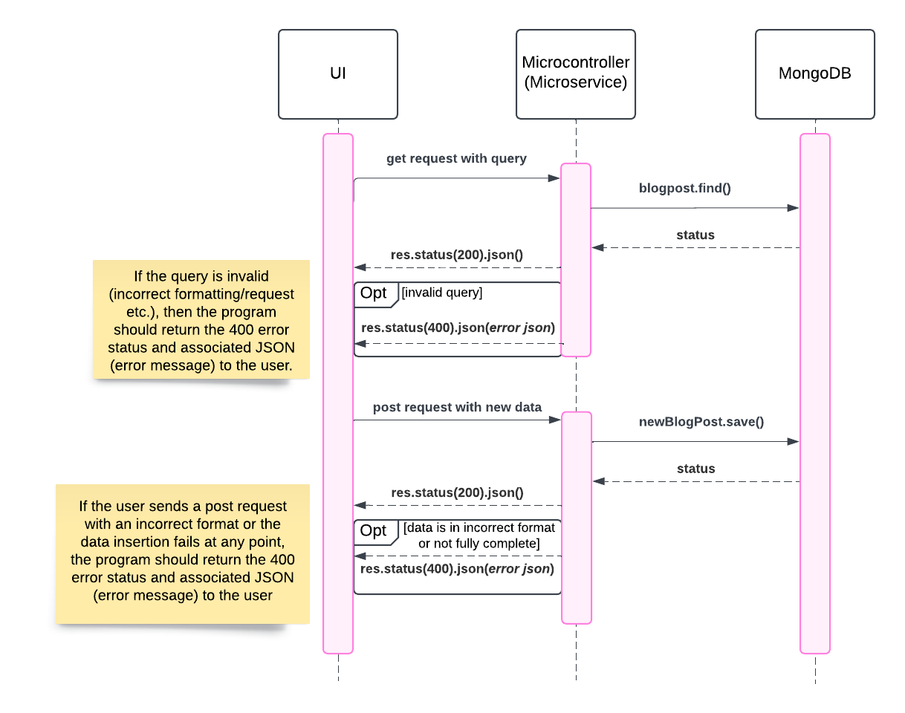

## Microservice A

_NOTE: for explaining how to REQUEST and RECIEVE data, viewing all blog posts is used as the example. This will look slightly different if you are creating a new post, but similar enough._
  
How to REQUEST data:
1. Enter all of the required attributes of the request in the form in the UI. In the case of a query (GET), no required attributes are needed/specified.
2. Send the request to retrieve data by calling the ".../create" route in the URL

How to RETRIEVE data:
1. app.post("/create", ...) handles this route above
2. This calls a query stored in the request's body to retrive the JSON file for the whole MongoDB database using the command "await BlogPost.find(query)".
3. MongoDB responds and sends back the JSON information for the database containing the database's information
4. The microservice calls res.status(200).json({ _database info_ }), with _database info_ containing the variable that holds the JSON recieved from the databse

 
## UML Diagram

